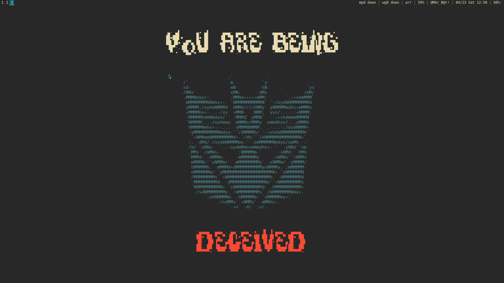

# Salve, straggler.

## Screenshots




## Instructions

Initiate a fresh Void Linux installation with these awesome AI MACHINE LEARNING
BLOCKCHAIN powered AGILE NINJA powered scripts which allow quick deployment of
amazing FEATURES.

### Install Dependencies

```
# ./install_packages.sh
```

### Symlink Dotfiles 

Be careful while doing this. Do not forget to look at which files the script
symlinks. For now, the script doesn't overwrite any files but caution is advised
anyway.
```
$ ./install.sh
```

### Change default shell

`chsh`

### Add power commands to NOPASSWD

Edit `/etc/sudoers` using the `visudo` command. Add the following line:

```
%wheel ALL=(ALL) NOPASSWD: /usr/bin/halt, /usr/bin/poweroff, /usr/bin/reboot, \
            /usr/bin/shutdown, /usr/bin/zzz, /usr/bin/ZZZ
```

### Install PulseAudio

Because it works(TM). Packages needed are included in `packages.txt`.

```
$ echo 'Start ALSA service'
# ln -s /etc/sv/alsa /var/service/
# ln -s /etc/sv/dbus /var/service/
# ln -s /etc/sv/cgmanager /var/service/
# ln -s /etc/sv/consolekit /var/service/
```

### Configure laptop lid behaviour

In `/etc/acpi/handler.sh`. You know the rest (I hope haha).

### Font Rendering (?)

I am unsure whether this step is required but disabling bitmap fonts helps
prevent some problems (eg. with Firefox).

[Blog link.](http://blog.brunomiguel.net/geekices/how-to-get-good-font-rendering-in-void-linux/)
[Archived link.](https://web.archive.org/web/20190801090733/http://blog.brunomiguel.net/geekices/how-to-get-good-font-rendering-in-void-linux/)

## Things That Do Not Matter

  
© All rights reserved by Scotty2Hotty. (I think.)

Welcome to the humble abode of my _dotfiles_. They work in mysterious ways. They
have their destination (relative to `$HOME`) as a comment and a script parses
them and symlinks them there.

Adieu, friend.
